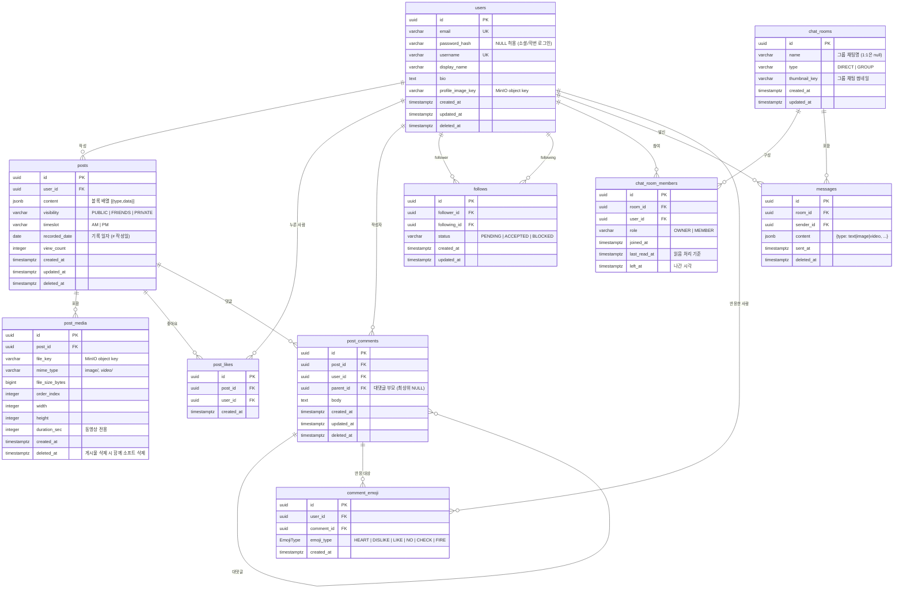

# ERD 초안 — 일상 아카이빙 SNS

> Sprint 0 초안 (2026-06-30). DB 스키마 리뷰 세션(수요일) 이후 확정.

---

## 핵심 설계 결정

| 결정 | 선택         | 이유 |
|----|---|---|
| PK 타입 | `UUID v7`  | 정렬 가능 + 분산 환경 충돌 없음. PG18 내장 `uuidv7()` + 앱(Hibernate)에서 v7 생성 → H2/PG18 공통 동작 |
| 게시물 본문 | `JSONB content[]` | 텍스트·이미지·비디오 블록 혼합 지원 |
| 친구 관계 | 단방향 follow (+ 상태 enum) | DM은 direct room으로 처리, 팔로우 비대칭 허용. 맞팔(친구)은 앱에서 상호 accepted로 판정 |
| 좋아요/댓글 | `post_likes`(**미사용**, 아래 DDL 주석 참고) / `post_comments` 별도 테이블 | 댓글은 `parent_id`로 대댓글(1단계) 지원 |
| 채팅 | ChatRoom + Members + Messages 3-테이블 | 1:1 / 그룹 채팅 공통 처리 |
| 읽음 처리 | `chat_room_members.last_read_at` 단일 필드 | watermark 방식. 그룹 "읽음 N"도 멤버별 last_read_at 비교로 계산 |
| 인증 | `password_hash` NULL 허용 | 소셜/학번(INU SSO) 로그인 유저는 비밀번호 없음 |
| Soft Delete | `deleted_at TIMESTAMPTZ` | users, posts, post_media, post_comments, messages 적용. Quota 집계는 `deleted_at IS NULL`만 |
| 이모지| 중복 불가 + 여러 이모지 태그 가능 | 다양한 반응을 사용하여 간단한 대화를 할 수 있게 함. |
| 타임존 | UTC 저장 → 클라이언트 변환 |   |

---

## Mermaid ERD



---

## JSONB 스키마 예시

### `posts.content` (블록 배열)
```json
[
  { "type": "text",  "data": { "body": "오늘 한강 다녀왔다" } },
  { "type": "image", "data": { "key": "posts/abc/0.webp", "width": 1080, "height": 1350 } },
  { "type": "video", "data": { "key": "posts/abc/1.mp4",  "duration": 32, "thumbnail_key": "posts/abc/1_thumb.webp" } }
]
```

### `messages.content`
```json
[
{ "type": "text",  "body": "ㅋㅋㅋ" },
{ "type": "image", "key": "chat/room_id/msg_id.webp" }
]
```

---

## SQL DDL 초안

> ⚠️ **정본은 이 문서가 아니라 Flyway 마이그레이션(`backend/src/main/resources/db/migration/`)이다.**
> #152에서 Flyway를 도입하면서 `infra/postgres/init/01_init.sql`은 삭제됐다. 아래 DDL은 설계 의도를
>한눈에 보기 위한 참고용이며, 실제 스키마를 바꿀 때는 새 마이그레이션 파일을 추가한다.
> 자세한 절차는 `docs/db-migration-guide.md` 참고.
>
> 아직 이 문서에 반영되지 않은 것: `fcm_tokens`(V3).

```sql
-- UUID v7: PostgreSQL 18 내장 uuidv7() 사용 → 별도 확장/라이브러리 불필요.
--          앱(Hibernate)에서도 동일하게 v7을 생성하므로 아래 DEFAULT는 SQL 직접 INSERT용 안전망.

-- ──────────────────────────────────────────────────────────────
-- ENUM 타입
-- ──────────────────────────────────────────────────────────────
CREATE TYPE visibility_type  AS ENUM ('PUBLIC', 'FRIENDS', 'PRIVATE');
CREATE TYPE timeslot_type    AS ENUM ('AM', 'PM');
CREATE TYPE follow_status    AS ENUM ('PENDING', 'ACCEPTED', 'BLOCKED');
CREATE TYPE chat_type        AS ENUM ('DIRECT', 'GROUP');
CREATE TYPE member_role      AS ENUM ('OWNER', 'MEMBER');
CREATE TYPE emoji_type       AS ENUM ('HEART', 'DISLIKE', 'LIKE', 'NO', 'CHECK', 'FIRE');

-- ──────────────────────────────────────────────────────────────
-- users
-- ──────────────────────────────────────────────────────────────
CREATE TABLE users (
    id                UUID        PRIMARY KEY DEFAULT uuidv7(),
    email             VARCHAR(320) NOT NULL UNIQUE,
    password_hash     VARCHAR(255),           -- NULL 허용: 소셜/학번(INU SSO) 로그인 유저는 비밀번호 없음
    username          VARCHAR(50)  NOT NULL UNIQUE,
    display_name      VARCHAR(100) NOT NULL,
    bio               TEXT,
    profile_image_key VARCHAR(500),
    created_at        TIMESTAMPTZ  NOT NULL DEFAULT NOW(),
    updated_at        TIMESTAMPTZ  NOT NULL DEFAULT NOW(),
    deleted_at        TIMESTAMPTZ
);

CREATE INDEX idx_users_email       ON users (email)    WHERE deleted_at IS NULL;
CREATE INDEX idx_users_username    ON users (username)  WHERE deleted_at IS NULL;

-- ──────────────────────────────────────────────────────────────
-- posts
-- ──────────────────────────────────────────────────────────────
CREATE TABLE posts (
    id            UUID           PRIMARY KEY DEFAULT uuidv7(),
    user_id       UUID           NOT NULL REFERENCES users(id),
    content       JSONB          NOT NULL DEFAULT '[]',
    visibility    visibility_type NOT NULL DEFAULT 'PUBLIC',
    timeslot      timeslot_type  NOT NULL
    recorded_date DATE           NOT NULL DEFAULT CURRENT_DATE,
    view_count    INTEGER        NOT NULL DEFAULT 0,
    created_at    TIMESTAMPTZ    NOT NULL DEFAULT NOW(),
    updated_at    TIMESTAMPTZ    NOT NULL DEFAULT NOW(),
    deleted_at    TIMESTAMPTZ
);

CREATE INDEX idx_posts_user_id       ON posts (user_id, recorded_date DESC) WHERE deleted_at IS NULL;
CREATE INDEX idx_posts_content_gin   ON posts USING GIN (content);  -- JSONB 검색

-- ──────────────────────────────────────────────────────────────
-- post_media
-- ──────────────────────────────────────────────────────────────
CREATE TABLE post_media (
    id              UUID        PRIMARY KEY DEFAULT uuidv7(),
    post_id         UUID        NOT NULL REFERENCES posts(id) ON DELETE CASCADE,
    file_key        VARCHAR(500) NOT NULL,
    mime_type       VARCHAR(100) NOT NULL,
    file_size_bytes BIGINT,
    order_index     SMALLINT    NOT NULL DEFAULT 0,
    width           INTEGER,
    height          INTEGER,
    duration_sec    INTEGER,
    created_at      TIMESTAMPTZ NOT NULL DEFAULT NOW(),
    deleted_at      TIMESTAMPTZ  -- 게시물 소프트 삭제 시 함께 채움. Quota 집계/파일 GC는 deleted_at IS NULL만 대상
);

CREATE INDEX idx_post_media_post_id ON post_media (post_id, order_index) WHERE deleted_at IS NULL;

-- ──────────────────────────────────────────────────────────────
-- post_likes (좋아요) — 미사용 (2026-08-20)
--   반응 모델이 댓글 이모지로 단일화되면서(#145) 게시물 좋아요는 미채택이 됐다.
--   자바 엔티티/리포지토리/서비스는 #148에서 제거했고, 테이블은 스키마 변경 승인 절차 때문에 남겨 뒀다.
--   쓰는 코드가 없으므로 새 기능에서 참조하지 말 것.
-- ──────────────────────────────────────────────────────────────
CREATE TABLE post_likes (
    id         UUID        PRIMARY KEY DEFAULT uuidv7(),
    post_id    UUID        NOT NULL REFERENCES posts(id) ON DELETE CASCADE,
    user_id    UUID        NOT NULL REFERENCES users(id) ON DELETE CASCADE,
    created_at TIMESTAMPTZ NOT NULL DEFAULT NOW(),
    CONSTRAINT uq_post_like UNIQUE (post_id, user_id)   -- 한 사람이 한 게시물에 한 번만
);

CREATE INDEX idx_post_likes_post ON post_likes (post_id);

-- ──────────────────────────────────────────────────────────────
-- post_comments (댓글 / 대댓글)
-- ──────────────────────────────────────────────────────────────
CREATE TABLE post_comments (
    id         UUID        PRIMARY KEY DEFAULT uuidv7(),
    post_id    UUID        NOT NULL REFERENCES posts(id) ON DELETE CASCADE,
    user_id    UUID        NOT NULL REFERENCES users(id),
    parent_id  UUID        REFERENCES post_comments(id) ON DELETE CASCADE,  -- 대댓글: 부모 댓글 (최상위는 NULL)
    body       TEXT        NOT NULL,
    created_at TIMESTAMPTZ NOT NULL DEFAULT NOW(),
    updated_at TIMESTAMPTZ NOT NULL DEFAULT NOW(),
    deleted_at TIMESTAMPTZ
);

CREATE INDEX idx_post_comments_post   ON post_comments (post_id, created_at) WHERE deleted_at IS NULL;
CREATE INDEX idx_post_comments_parent ON post_comments (parent_id)           WHERE parent_id IS NOT NULL;

-- ──────────────────────────────────────────────────────────────
-- follows
-- ──────────────────────────────────────────────────────────────
CREATE TABLE follows (
    id            UUID         PRIMARY KEY DEFAULT uuidv7(),
    follower_id   UUID         NOT NULL REFERENCES users(id),
    following_id  UUID         NOT NULL REFERENCES users(id),
    status        follow_status NOT NULL DEFAULT 'PENDING',
    created_at    TIMESTAMPTZ  NOT NULL DEFAULT NOW(),
    updated_at    TIMESTAMPTZ  NOT NULL DEFAULT NOW(),
    CONSTRAINT uq_follows UNIQUE (follower_id, following_id),
    CONSTRAINT chk_no_self_follow CHECK (follower_id <> following_id)
);

CREATE INDEX idx_follows_follower   ON follows (follower_id,  status);
CREATE INDEX idx_follows_following  ON follows (following_id, status);

-- ──────────────────────────────────────────────────────────────
-- chat_rooms
-- ──────────────────────────────────────────────────────────────
CREATE TABLE chat_rooms (
    id            UUID      PRIMARY KEY DEFAULT uuidv7(),
    name          VARCHAR(100),
    type          chat_type  NOT NULL DEFAULT 'DIRECT',
    thumbnail_key VARCHAR(500),
    created_at    TIMESTAMPTZ NOT NULL DEFAULT NOW(),
    updated_at    TIMESTAMPTZ NOT NULL DEFAULT NOW()
);

-- ──────────────────────────────────────────────────────────────
-- chat_room_members
-- ──────────────────────────────────────────────────────────────
CREATE TABLE chat_room_members (
    id            UUID        PRIMARY KEY DEFAULT uuidv7(),
    room_id       UUID        NOT NULL REFERENCES chat_rooms(id) ON DELETE CASCADE,
    user_id       UUID        NOT NULL REFERENCES users(id),
    role          member_role  NOT NULL DEFAULT 'MEMBER',
    joined_at     TIMESTAMPTZ  NOT NULL DEFAULT NOW(),
    last_read_at  TIMESTAMPTZ  NOT NULL DEFAULT NOW(),
    left_at       TIMESTAMPTZ,
    CONSTRAINT uq_room_member UNIQUE (room_id, user_id)
);

CREATE INDEX idx_members_user_id ON chat_room_members (user_id) WHERE left_at IS NULL;

-- ──────────────────────────────────────────────────────────────
-- messages
-- ──────────────────────────────────────────────────────────────
CREATE TABLE messages (
    id          UUID        PRIMARY KEY DEFAULT uuidv7(),
    room_id     UUID        NOT NULL REFERENCES chat_rooms(id),
    sender_id   UUID        NOT NULL REFERENCES users(id),
    content     JSONB       NOT NULL,
    sent_at     TIMESTAMPTZ  NOT NULL DEFAULT NOW(),
    deleted_at  TIMESTAMPTZ
);

CREATE INDEX idx_messages_room_id ON messages (room_id, sent_at DESC) WHERE deleted_at IS NULL;

-- ──────────────────────────────────────────────────────────────
-- comment_emoji (댓글 반응)
-- 반응 대상이 이름에 드러나야 채팅 반응(ChatEmoji, 미구현)이 chat_emoji로 갈라진다.
-- ──────────────────────────────────────────────────────────────
CREATE TABLE comment_emoji (
    id          UUID        PRIMARY KEY DEFAULT uuidv7(),
    user_id     UUID        NOT NULL REFERENCES users(id),
    comment_id  UUID        NOT NULL REFERENCES post_comments(id) ON DELETE CASCADE,
    emoji_type  emoji_type  NOT NULL DEFAULT 'HEART',
    created_at  TIMESTAMPTZ NOT NULL DEFAULT NOW(),
    CONSTRAINT uk_comment_emoji UNIQUE (user_id, comment_id, emoji_type)
);

-- 댓글 목록용 배치 집계(comment_id IN ... GROUP BY emoji_type)용.
-- uk_comment_emoji는 선두가 user_id라 이 쿼리를 못 탄다.
CREATE INDEX idx_comment_emoji_comment ON comment_emoji (comment_id, emoji_type);

```

---

## 확정 사항

| # | 결정 | 내용 |
|---|---|---|
| A | **UUID v7 생성 방식** | PG18 내장 `uuidv7()` 사용(확장 불필요). 앱은 `com.fasterxml.uuid:java-uuid-generator`로 v7 생성 → `@GeneratedUuidV7` 어노테이션(`global.support`)을 PK에 부착. DB `DEFAULT uuidv7()`는 SQL 직접 INSERT용 안전망. H2(로컬)·PG18(운영) 공통 동작. |
| B | **좋아요/댓글** | `post_likes`(유저×게시물 UNIQUE) + `post_comments`(`parent_id`로 대댓글 1단계) 별도 테이블로 지금 추가. 개수는 `COUNT(*)`로 조회(비정규화 카운터는 트래픽 증가 후 도입). <br>**2026-08-20 갱신:** 반응은 댓글 이모지(`comment_emoji`)로 단일화됐고 게시물 좋아요는 미채택이다(#145·#148). `post_likes`를 쓰는 코드는 없다. |
| C | **팔로우 방향** | 단방향 `follows` 유지. "맞팔(친구)"은 스키마가 아니라 앱에서 상호 `accepted` 여부로 판정 → 테이블 변경 없음. |
| D | **읽음 처리** | `chat_room_members.last_read_at` 단일 필드(watermark)로 확정. 그룹 "읽음 N"도 멤버별 `last_read_at ≥ message.sent_at` 비교로 계산. `message_reads` 별도 테이블은 행 폭증으로 미채택. |
| E | **인증 (password_hash)** | `NULL 허용`으로 변경. 소셜/학번(INU SSO) 로그인 유저는 비밀번호가 없음. 멀티 프로바이더(한 유저가 여러 로그인 수단 연결)용 `user_auth_providers` 테이블은 소셜 로그인 실제 구현 시 도입. |
| F | **Soft Delete 일관성** | `deleted_at`을 `post_media`·`post_comments`에도 추가. 게시물 소프트 삭제 시 하위 미디어도 함께 소프트 삭제하고, **Quota 집계·파일 GC는 `deleted_at IS NULL`인 미디어만** 대상. (`ON DELETE CASCADE`는 하드 삭제 때만 동작하므로 소프트 삭제엔 앱 로직으로 전파) |

> UUID v7 생성 인프라(`@GeneratedUuidV7` 어노테이션 + 제너레이터)는 이 브랜치에 포함.
> ⚠️ **엔티티 PK 적용은 각 도메인 담당자 몫.** `Member` 엔티티는 **BE 주니어 1의 열린 PR #19(feature/auth-login)** 에서 `Long` → `UUID`로 반영 예정(중복 작업/충돌 방지). 신규 엔티티(posts, messages 등)는 처음부터 `@GeneratedUuidV7` 사용.
> ⚠️ **`password_hash` NULL 허용도 `Member` 엔티티에 반영 필요** — PR #19에서 `@Column(name = "password_hash", nullable = false)` → `nullable = true`로.

---

## 미결 사항 (수요일 리뷰 전까지 논의 필요)

| # | 질문 | 후보 |
|---|---|---|
| 4 | `posts.content`(JSONB) ↔ `post_media`(테이블) 미디어 중복 | JSONB=렌더링 순서+텍스트, post_media=파일 진실의 원천(메타/Quota). JSONB가 파일 메타를 복사할지 vs `post_media_id`만 참조할지 (이번 반영에서 제외 — 별도 결정) |
