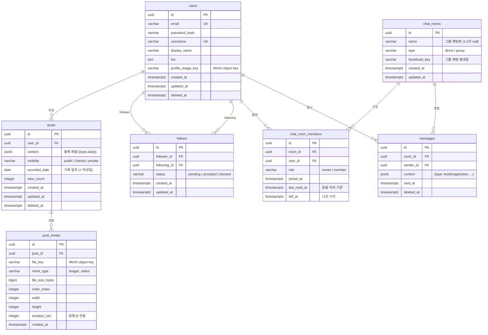

# ERD 초안 — 일상 아카이빙 SNS

> Sprint 0 초안 (2026-06-30). DB 스키마 리뷰 세션(수요일) 이후 확정.

---

## 핵심 설계 결정

| 결정 | 선택 | 이유 |
|---|---|---|
| PK 타입 | `UUID v7` | 정렬 가능 + 분산 환경 충돌 없음. PG18 내장 `uuidv7()` + 앱(Hibernate)에서 v7 생성 → H2/PG18 공통 동작 |
| 게시물 본문 | `JSONB content[]` | 텍스트·이미지·비디오 블록 혼합 지원 |
| 친구 관계 | 단방향 follow (+ 상태 enum) | DM은 direct room으로 처리, 팔로우 비대칭 허용 |
| 채팅 | ChatRoom + Members + Messages 3-테이블 | 1:1 / 그룹 채팅 공통 처리 |
| Soft Delete | `deleted_at TIMESTAMPTZ` | users, posts, messages 전체 적용 |
| 타임존 | UTC 저장 → 클라이언트 변환 | |

---

## Mermaid ERD



---

## JSONB 스키마 예시

### `posts.content` (블록 배열)
```json
[
  { "type": "text",  "data": { "body": "오늘 한강 다녀왔다" } },
  { "type": "image", "data": { "key": "posts/abc/0.webp", "width": 1080, "height": 1350 } },
  { "type": "video", "data": { "key": "posts/abc/1.mp4",  "duration": 32, "thumbnail_key": "posts/abc/1_thumb.webp" } }
]
```

### `messages.content`
```json
{ "type": "text",  "body": "ㅋㅋㅋ" }
{ "type": "image", "key": "chat/room_id/msg_id.webp" }
```

---

## SQL DDL 초안

```sql
-- UUID v7: PostgreSQL 18 내장 uuidv7() 사용 → 별도 확장/라이브러리 불필요.
--          앱(Hibernate)에서도 동일하게 v7을 생성하므로 아래 DEFAULT는 SQL 직접 INSERT용 안전망.

-- ──────────────────────────────────────────────────────────────
-- ENUM 타입
-- ──────────────────────────────────────────────────────────────
CREATE TYPE visibility_type  AS ENUM ('public', 'friends', 'private');
CREATE TYPE follow_status     AS ENUM ('pending', 'accepted', 'blocked');
CREATE TYPE chat_type         AS ENUM ('direct', 'group');
CREATE TYPE member_role       AS ENUM ('owner', 'member');

-- ──────────────────────────────────────────────────────────────
-- users
-- ──────────────────────────────────────────────────────────────
CREATE TABLE users (
    id                UUID        PRIMARY KEY DEFAULT uuidv7(),
    email             VARCHAR(320) NOT NULL UNIQUE,
    password_hash     VARCHAR(255) NOT NULL,
    username          VARCHAR(50)  NOT NULL UNIQUE,
    display_name      VARCHAR(100) NOT NULL,
    bio               TEXT,
    profile_image_key VARCHAR(500),
    created_at        TIMESTAMPTZ  NOT NULL DEFAULT NOW(),
    updated_at        TIMESTAMPTZ  NOT NULL DEFAULT NOW(),
    deleted_at        TIMESTAMPTZ
);

CREATE INDEX idx_users_email       ON users (email)    WHERE deleted_at IS NULL;
CREATE INDEX idx_users_username    ON users (username)  WHERE deleted_at IS NULL;

-- ──────────────────────────────────────────────────────────────
-- posts
-- ──────────────────────────────────────────────────────────────
CREATE TABLE posts (
    id            UUID           PRIMARY KEY DEFAULT uuidv7(),
    user_id       UUID           NOT NULL REFERENCES users(id),
    content       JSONB          NOT NULL DEFAULT '[]',
    visibility    visibility_type NOT NULL DEFAULT 'public',
    recorded_date DATE           NOT NULL DEFAULT CURRENT_DATE,
    view_count    INTEGER        NOT NULL DEFAULT 0,
    created_at    TIMESTAMPTZ    NOT NULL DEFAULT NOW(),
    updated_at    TIMESTAMPTZ    NOT NULL DEFAULT NOW(),
    deleted_at    TIMESTAMPTZ
);

CREATE INDEX idx_posts_user_id       ON posts (user_id, recorded_date DESC) WHERE deleted_at IS NULL;
CREATE INDEX idx_posts_content_gin   ON posts USING GIN (content);  -- JSONB 검색

-- ──────────────────────────────────────────────────────────────
-- post_media
-- ──────────────────────────────────────────────────────────────
CREATE TABLE post_media (
    id              UUID        PRIMARY KEY DEFAULT uuidv7(),
    post_id         UUID        NOT NULL REFERENCES posts(id) ON DELETE CASCADE,
    file_key        VARCHAR(500) NOT NULL,
    mime_type       VARCHAR(100) NOT NULL,
    file_size_bytes BIGINT,
    order_index     SMALLINT    NOT NULL DEFAULT 0,
    width           INTEGER,
    height          INTEGER,
    duration_sec    INTEGER,
    created_at      TIMESTAMPTZ NOT NULL DEFAULT NOW()
);

CREATE INDEX idx_post_media_post_id ON post_media (post_id, order_index);

-- ──────────────────────────────────────────────────────────────
-- follows
-- ──────────────────────────────────────────────────────────────
CREATE TABLE follows (
    id            UUID         PRIMARY KEY DEFAULT uuidv7(),
    follower_id   UUID         NOT NULL REFERENCES users(id),
    following_id  UUID         NOT NULL REFERENCES users(id),
    status        follow_status NOT NULL DEFAULT 'pending',
    created_at    TIMESTAMPTZ  NOT NULL DEFAULT NOW(),
    updated_at    TIMESTAMPTZ  NOT NULL DEFAULT NOW(),
    CONSTRAINT uq_follows UNIQUE (follower_id, following_id),
    CONSTRAINT chk_no_self_follow CHECK (follower_id <> following_id)
);

CREATE INDEX idx_follows_follower   ON follows (follower_id,  status);
CREATE INDEX idx_follows_following  ON follows (following_id, status);

-- ──────────────────────────────────────────────────────────────
-- chat_rooms
-- ──────────────────────────────────────────────────────────────
CREATE TABLE chat_rooms (
    id            UUID      PRIMARY KEY DEFAULT uuidv7(),
    name          VARCHAR(100),
    type          chat_type  NOT NULL DEFAULT 'direct',
    thumbnail_key VARCHAR(500),
    created_at    TIMESTAMPTZ NOT NULL DEFAULT NOW(),
    updated_at    TIMESTAMPTZ NOT NULL DEFAULT NOW()
);

-- ──────────────────────────────────────────────────────────────
-- chat_room_members
-- ──────────────────────────────────────────────────────────────
CREATE TABLE chat_room_members (
    id            UUID        PRIMARY KEY DEFAULT uuidv7(),
    room_id       UUID        NOT NULL REFERENCES chat_rooms(id) ON DELETE CASCADE,
    user_id       UUID        NOT NULL REFERENCES users(id),
    role          member_role  NOT NULL DEFAULT 'member',
    joined_at     TIMESTAMPTZ  NOT NULL DEFAULT NOW(),
    last_read_at  TIMESTAMPTZ  NOT NULL DEFAULT NOW(),
    left_at       TIMESTAMPTZ,
    CONSTRAINT uq_room_member UNIQUE (room_id, user_id)
);

CREATE INDEX idx_members_user_id ON chat_room_members (user_id) WHERE left_at IS NULL;

-- ──────────────────────────────────────────────────────────────
-- messages
-- ──────────────────────────────────────────────────────────────
CREATE TABLE messages (
    id          UUID        PRIMARY KEY DEFAULT uuidv7(),
    room_id     UUID        NOT NULL REFERENCES chat_rooms(id),
    sender_id   UUID        NOT NULL REFERENCES users(id),
    content     JSONB       NOT NULL,
    sent_at     TIMESTAMPTZ  NOT NULL DEFAULT NOW(),
    deleted_at  TIMESTAMPTZ
);

CREATE INDEX idx_messages_room_id ON messages (room_id, sent_at DESC) WHERE deleted_at IS NULL;
```

---

## 확정 사항

| # | 결정 | 내용 |
|---|---|---|
| A | **UUID v7 생성 방식** | PG18 내장 `uuidv7()` 사용(확장 불필요). 앱은 `com.fasterxml.uuid:java-uuid-generator`로 v7 생성 → `@GeneratedUuidV7` 어노테이션(`global.support`)을 PK에 부착. DB `DEFAULT uuidv7()`는 SQL 직접 INSERT용 안전망. H2(로컬)·PG18(운영) 공통 동작. |

> UUID v7 생성 인프라(`@GeneratedUuidV7` 어노테이션 + 제너레이터)는 이 브랜치에 포함.
> ⚠️ **엔티티 PK 적용은 각 도메인 담당자 몫.** `Member` 엔티티는 **BE 주니어 1의 열린 PR #19(feature/auth-login)** 에서 `Long` → `UUID`로 반영 예정(중복 작업/충돌 방지). 신규 엔티티(posts, messages 등)는 처음부터 `@GeneratedUuidV7` 사용.

---

## 미결 사항 (수요일 리뷰 전까지 논의 필요)

| # | 질문 | 후보 |
|---|---|---|
| 1 | 좋아요/댓글 테이블을 지금 추가할까? | Sprint 0 포함 vs Sprint 1으로 미룸 |
| 2 | 팔로우 vs 맞팔(친구) 구분 필요? | 현재 `follows.status = accepted`로 처리 |
| 3 | 메시지 읽음 처리 세분화? | `last_read_at` 방식 vs `message_reads` 별도 테이블 |
| 4 | `posts.content`(JSONB) ↔ `post_media`(테이블) 미디어 중복 | JSONB=렌더링 순서, post_media=파일 메타/Quota 집계로 역할 분리 vs 통합 |
| 5 | `users.password_hash` NOT NULL | 소셜/학번 로그인 확장 시 비밀번호 없는 유저 발생 가능 → 인증 방식 확장 계획 합의 |
